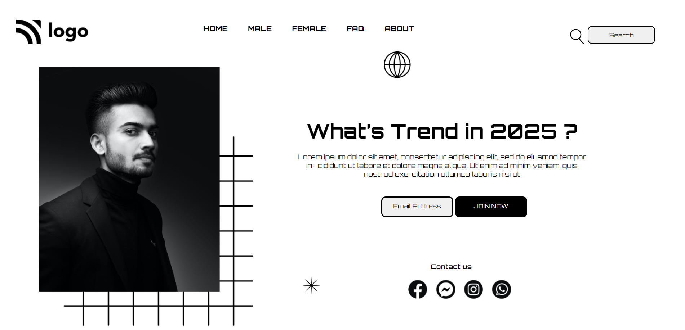

# Project-01
Done By  -   

  

This project is made, using Basic HTML and CSS.
 
  

 

 
  
 
 
  

 

  

 To complete this project, HTML elements which are properly enclosed in classes are used, 
so that it becomes easy while selecting and styling the elements using CSS.

 [Click-here for **Project Live Link**](https://htmlcss-project-01.netlify.app/)
  

 This is how the output of this project looks like:  

 

 

### By completing this project, I learnt many things about CSS. Few include:

- Positions - relative, fixed, absolute
- Importing google fonts.
- Text properties - fontsize, color, font-family etc
- Styling a Button
- About Margin and Padding

 ### It took me around 4.5 hours to complete this project ! 